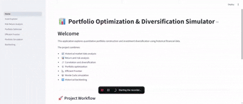

# 🇮🇩 Portfolio Optimization & Diversification Simulator

> A quantitative investment portfolio simulator for the Indonesian stock market that analyzes risk, return, diversification, portfolio optimization, Monte Carlo simulation, and historical backtesting.

---

## 📌 Overview

The **Portfolio Optimization & Diversification Simulator** is a quantitative finance project designed to help investors explore how capital can be allocated across multiple assets in the **Indonesian stock market**.

The project combines:

* Statistical analysis
* Historical market data analysis
* Modern Portfolio Theory
* Risk and return analysis
* Correlation analysis
* Mathematical portfolio optimization
* Efficient frontier analysis
* Monte Carlo simulation
* Scenario analysis
* Historical backtesting

The system analyzes historical price data of selected Indonesian stocks and determines how capital can be allocated across multiple assets based on different portfolio construction strategies.

The main objective is to answer:

> **"Given a set of Indonesian stocks, how should capital be distributed across multiple assets to achieve an attractive risk-adjusted portfolio while maintaining diversification?"**

The project also demonstrates how diversification across different industries can potentially reduce portfolio concentration risk and improve risk-adjusted performance.


---

## 🎯 Objectives

The main objectives of this project are:

1. Analyze historical price movements of Indonesian stocks.
2. Analyze stocks from different industries and sectors.
3. Estimate historical returns and portfolio risk.
4. Analyze correlations between assets to evaluate diversification benefits.
5. Determine optimal portfolio allocation using mathematical optimization.
6. Compare multiple portfolio construction strategies.
7. Visualize the efficient frontier and optimal portfolios.
8. Simulate potential future portfolio outcomes using Monte Carlo simulation.
9. Perform scenario analysis under different market assumptions.
10. Evaluate portfolio strategies through historical backtesting.
11. Provide an interactive Streamlit dashboard for portfolio analysis and optimization.
12. Provide a modular and reproducible quantitative investment framework.

---

## Indonesian Market Focus

The initial version of this project focuses on publicly traded companies listed on the **Indonesia Stock Exchange (IDX)**.

The asset universe is designed to include stocks from different industries to support diversification analysis.

Example sectors include:

* 🏦 Banking
* 📡 Telecommunications
* ⛽ Energy / Oil & Gas
* 🛒 Consumer
* 🏗️ Infrastructure
* 🚬 Consumer Defensive
* 🏭 Industrials
* ⛏️ Basic Materials
* 🏢 Property
* 🚗 Automotive

Indonesian stock tickers are represented using the Yahoo Finance format.

For example:

```text
BBCA.JK
BBRI.JK
BMRI.JK
BBNI.JK
TLKM.JK
ASII.JK
UNVR.JK
ANTM.JK
ADRO.JK
PGAS.JK
```

The project is designed to support multiple stocks within each industry, allowing users to explore both:

* **Within-sector diversification**
* **Cross-sector diversification**

The asset universe can be extended through:

```text
config/assets.yaml
```

---

## 💡 Problem Statement

An investor typically faces a trade-off between **return and risk**.

Investing heavily in high-return stocks may increase the potential return of a portfolio, but it may also expose the investor to higher volatility and larger drawdowns.

On the other hand, investing equally across many stocks may reduce concentration risk but does not necessarily produce the most efficient risk-adjusted portfolio.

Therefore, the key problem is:

> **How can we determine the optimal proportion of capital allocated to each Indonesian stock while balancing expected return, portfolio risk, and diversification?**

This project addresses the problem using portfolio optimization techniques based on **Modern Portfolio Theory (MPT)**.

---
## 🎥 Application Demo

<p align="center">
  
</p>

---

# 🏗️ System Architecture

The overall workflow of the application is:

```text
                         ┌─────────────────────┐
                         │    User / Investor   │
                         └──────────┬──────────┘
                                    │
                                    ▼
                         ┌─────────────────────┐
                         │   Streamlit App     │
                         │  Portfolio Dashboard│
                         └──────────┬──────────┘
                                    │
                  ┌─────────────────┼─────────────────┐
                  │                 │                 │
                  ▼                 ▼                 ▼
           Asset Selection     Investment Goal    Risk Profile
                  │                 │                 │
                  └─────────────────┼─────────────────┘
                                    ▼
                         ┌─────────────────────┐
                         │ Portfolio Analytics │
                         └──────────┬──────────┘
                                    │
             ┌──────────────────────┼──────────────────────┐
             │                      │                      │
             ▼                      ▼                      ▼
      Return Analysis        Risk Analysis        Correlation
             │                      │                      │
             └──────────────────────┼──────────────────────┘
                                    ▼
                         ┌─────────────────────┐
                         │ Portfolio Optimizer │
                         └──────────┬──────────┘
                                    │
             ┌──────────────────────┼──────────────────────┐
             │                      │                      │
             ▼                      ▼                      ▼
      Min Variance          Max Sharpe Ratio       Equal Weight
             │                      │                      │
             └──────────────────────┼──────────────────────┘
                                    ▼
                         ┌─────────────────────┐
                         │ Portfolio Simulation│
                         └──────────┬──────────┘
                                    │
                    ┌───────────────┼───────────────┐
                    │               │               │
                    ▼               ▼               ▼
              Backtesting    Monte Carlo     Scenario Analysis
                    │               │               │
                    └───────────────┼───────────────┘
                                    ▼
                         ┌─────────────────────┐
                         │ Investment Insights │
                         └─────────────────────┘
```

---

# 🚀 Application Features

The Streamlit dashboard contains six main pages.

## 1. 📊 Asset Explorer

The Asset Explorer provides an overview of the available investment universe.

Users can:

* Browse available Indonesian stocks.
* Filter stocks by asset class.
* Filter stocks by sector or industry.
* Select individual assets.
* View historical price data.
* Visualize historical price movements.
* Analyze basic asset information.

---

## 2. ⚖️ Risk & Return Analysis

This page evaluates the historical risk-return characteristics of selected assets.

The analysis includes:

* Annualized return
* CAGR
* Annualized volatility
* Sharpe ratio
* Sortino ratio
* Maximum drawdown
* Downside deviation
* Correlation analysis
* Rolling volatility
* Historical drawdown

The risk-return scatter plot helps identify assets with potentially attractive historical risk-adjusted performance.

---

## 3. 📈 Portfolio Optimizer

The Portfolio Optimizer determines portfolio allocations based on different investment strategies.

Supported strategies include:

### Equal Weight

Each selected asset receives the same portfolio weight.

```text
w_i = 1 / N
```

where:

* `w_i` = portfolio weight of asset `i`
* `N` = number of assets

---

### Minimum Variance

The optimizer seeks to minimize portfolio volatility.

The objective is:

```text
minimize:

σ²_p = wᵀΣw
```

subject to portfolio constraints.

---

### Maximum Sharpe Ratio

The optimizer seeks to maximize the portfolio's risk-adjusted return.

The objective is:

```text
maximize:

Sharpe = (R_p - R_f) / σ_p
```

where:

* `R_p` = portfolio expected return
* `R_f` = risk-free rate
* `σ_p` = portfolio volatility

---

## 4. 📉 Efficient Frontier

The Efficient Frontier page visualizes the relationship between portfolio expected return and portfolio risk.

The application generates multiple portfolios with different risk-return combinations and identifies portfolios that provide the best expected return for a given level of risk.

The analysis highlights:

* Minimum variance portfolio
* Maximum Sharpe portfolio
* Efficient frontier
* Random portfolio simulations
* Portfolio risk
* Portfolio expected return

---

## 5. 🔮 Portfolio Simulation

The Portfolio Simulation page estimates potential future portfolio values based on historical data and statistical assumptions.

The application supports:

### Monte Carlo GBM

Geometric Brownian Motion is used to simulate possible future portfolio paths.

The model is:

```text
S(t+1) = S(t) × exp(
    (μ - 0.5σ²)dt
    + σ√dt Z
)
```

where:

* `S(t)` = Portfolio value at time `t`
* `μ` = Expected annual return
* `σ` = Annualized volatility
* `dt` = Time step
* `Z` = Standard normal random variable

---

### Historical Bootstrap

Historical daily returns are randomly sampled to generate potential future portfolio paths.

This approach attempts to preserve characteristics of the observed historical return distribution.

---

### Scenario Analysis

The simulation also evaluates three simplified scenarios:

* **Bear** — Lower expected return and higher volatility
* **Base** — Historical expected return and volatility
* **Bull** — Higher expected return and lower volatility

The simulation reports:

* Median final value
* Mean final value
* 5th percentile
* 95th percentile
* Probability of profit
* Probability of loss

The initial investment and simulated portfolio values are displayed in **Indonesian Rupiah (IDR)**.

---

## 6. 📊 Backtesting

The Backtesting page evaluates how portfolio strategies would have performed historically.

The backtesting framework can be used to compare:

* Equal Weight
* Minimum Variance
* Maximum Sharpe
* Other portfolio strategies

Performance metrics include:

* Cumulative return
* Annualized return
* Annualized volatility
* Sharpe ratio
* Maximum drawdown
* Portfolio growth

Backtesting helps evaluate how different portfolio construction methods would have behaved under historical market conditions.

---

# 📂 Project Structure

```text
portfolio-optimization-simulator/
│
├── README.md
├── LICENSE
├── .gitignore
├── requirements.txt
├── Dockerfile
├── docker-compose.yml
│
├── app/
│   ├── Home.py
│   │
│   ├── pages/
│   │   ├── 01_Asset_Explorer.py
│   │   ├── 02_Risk_Return_Analysis.py
│   │   ├── 03_Portfolio_Optimizer.py
│   │   ├── 04_Efficient_Frontier.py
│   │   ├── 05_Portfolio_Simulation.py
│   │   └── 06_Backtesting.py
│   │
│   └── components/
│       ├── charts.py
│       ├── tables.py
│       └── metrics.py
│
├── src/
│   ├── data/
│   │   ├── loader.py
│   │   ├── downloader.py
│   │   └── preprocessing.py
│   │
│   ├── analytics/
│   │   ├── returns.py
│   │   ├── risk.py
│   │   ├── correlation.py
│   │   └── performance.py
│   │
│   ├── optimization/
│   │   ├── base.py
│   │   ├── equal_weight.py
│   │   ├── minimum_variance.py
│   │   ├── maximum_sharpe.py
│   │   └── target_return.py
│   │
│   ├── simulation/
│   │   ├── monte_carlo.py
│   │   ├── historical.py
│   │   └── scenario.py
│   │
│   └── backtesting/
│       ├── engine.py
│       └── metrics.py
│
├── config/
│   ├── assets.yaml
│   └── settings.yaml
│
├── data/
│   ├── raw/
│   ├── processed/
│   └── external/
│
│
└── docs/
    ├── methodology.md
    └── assumptions_and_limitations.md
```

---

# 🛠️ Technology Stack

### Programming Language

* Python 3.11

### Data Analysis

* NumPy
* Pandas

### Financial Data

* Yahoo Finance

### Quantitative Finance

* Modern Portfolio Theory
* Portfolio Optimization
* Risk Analysis
* Monte Carlo Simulation
* Historical Bootstrap
* Backtesting

### Visualization

* Plotly
* Streamlit

### Configuration

* YAML

### Deployment

* Docker
* Docker Compose

---

# 🐳 Running the Application with Docker

Docker is recommended for running the application in a reproducible environment.

## Prerequisites

Install:

* Docker Desktop
* Git (optional)

Verify the installation:

```bash
docker --version
docker compose version
```

---

## 1. Clone the Repository

```bash
git clone git@github.com:fifah123/portfolio-optimization-simulator.git
cd portfolio-optimization-simulator
```

Or navigate to the existing project directory:

```text
portfolio-optimization-simulator/
```

---


## 2. Build and Start the Application

Run:

```bash
docker compose up --build
```

This command will:

1. Build the Docker image.
2. Install the Python dependencies.
3. Start the Streamlit application.
4. Expose the application on port `8501`.

Open your browser and navigate to:

```text
http://localhost:8501
```

---


# 💻 Running Locally Without Docker

For development, the application can also be run directly using Python.

Create a virtual environment:

```bash
python -m venv .venv
```

Activate the environment.

### Windows PowerShell

```powershell
.venv\Scripts\Activate.ps1
```

Install dependencies:

```bash
pip install -r requirements.txt
```

Run the Streamlit application:

```bash
streamlit run app/Home.py
```

Open:

```text
http://localhost:8501
```

---

# 📚 Methodology

The project follows the following quantitative investment workflow:

```text
Historical Market Data
        │
        ▼
Data Cleaning & Preprocessing
        │
        ▼
Daily Return Calculation
        │
        ▼
Return & Risk Estimation
        │
        ├── Expected Return
        ├── Volatility
        ├── Sharpe Ratio
        ├── Sortino Ratio
        └── Maximum Drawdown
        │
        ▼
Correlation Analysis
        │
        ▼
Portfolio Optimization
        │
        ├── Equal Weight
        ├── Minimum Variance
        └── Maximum Sharpe
        │
        ▼
Efficient Frontier Analysis
        │
        ▼
Portfolio Simulation
        │
        ├── Monte Carlo GBM
        ├── Historical Bootstrap
        └── Scenario Analysis
        │
        ▼
Historical Backtesting
        │
        ▼
Portfolio Performance Evaluation
```

Detailed methodology is available in:

```text
docs/methodology.md
```

Mathematical formulas are documented in:

```text
docs/mathematical_formulas.md
```

Assumptions and limitations are documented in:

```text
docs/assumptions_and_limitations.md
```

---

# ⚠️ Assumptions and Limitations

The results generated by this application depend on several assumptions.

These include:

* Historical returns are informative of potential future behavior.
* Historical volatility is representative of future risk.
* Asset returns can be estimated from historical data.
* Portfolio correlations remain reasonably stable.
* Transaction costs and market impact may be ignored.
* Taxes and trading fees may not be fully incorporated.
* Short selling constraints may apply.
* Portfolio weights may be subject to optimization constraints.
* Monte Carlo simulations depend on model assumptions.
* Backtesting results are sensitive to the selected historical period.

The application should therefore be treated as a **quantitative research and educational tool**, rather than a guaranteed forecasting system.

---

# ⚠️ Disclaimer

This project is intended for **educational, research, and quantitative analysis purposes only**.

The portfolio allocations, simulations, optimization results, and backtesting results presented by this application are based on historical data and mathematical assumptions.

Historical performance does not guarantee future investment results.

The output of this application should **not be considered financial, investment, or professional advice**.

Users should conduct their own research and consult a qualified financial professional before making investment decisions.

